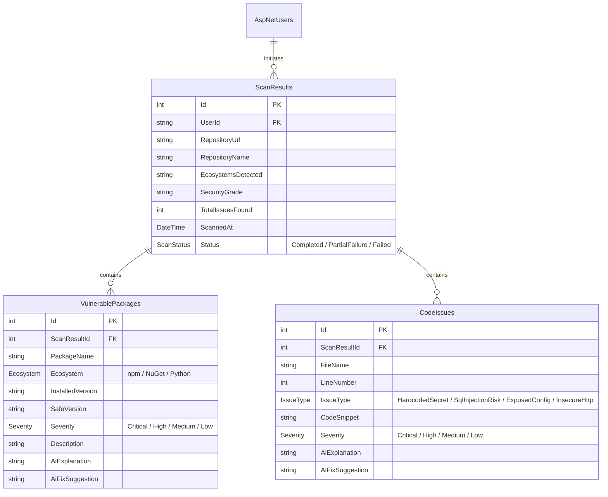

# 🛡️ CodeShield (Valkyire)

> A modular, web-based security scanner that analyzes **public GitHub repositories** for vulnerable packages and insecure code patterns — with plain-English AI explanations and fix suggestions.

Built with **ASP.NET Core (.NET 10)**, Razor Views, Entity Framework Core, and a custom **Neo-Brutalist Design System**.

---

## 🚀 Key Features

### 🔍 Repository Intake & Monorepo Support
- Validates public GitHub repository URLs before any scanning begins.
- Queries the **GitHub REST API** to recursively fetch the repository's file tree.
- Enforces a **1,000-file threshold** to avoid scanning extremely large repositories.
- Detects supported ecosystems (`package.json`, `.csproj`, `requirements.txt`) and fails fast with a clear message if none are found.
- Supports **Monorepos**: Scans all supported ecosystems found in a repository and groups findings cleanly by ecosystem in the UI.

### 📦 Dependency Vulnerability Scanning
- Full support for **npm** (`package.json`) and **NuGet** (`.csproj`) dependency parsing.
- Queries the free, public **OSV.dev API** in batches to check installed package versions against known CVEs.
- Handles partial API failures gracefully — shows results that succeeded with a warning note for any that couldn't be checked.

### 🐍 Python (Partial Support)
- When only `requirements.txt` is detected, the code pattern scanner still runs.
- A **prominent banner** is shown on the results page making it clear that package vulnerability scanning is not available for Python — this is a valid, successful scan outcome.

### 🧩 Code Pattern Scanning
- Scans C#, JavaScript, and Python source files using conservative **regular expression** patterns.
- Detects four issue types:
  | Issue Type | Description |
  |---|---|
  | `HardcodedSecret` | Secrets or API keys embedded in source files |
  | `SqlInjectionRisk` | Raw string concatenation passed directly into SQL keywords |
  | `ExposedConfig` | Sensitive configuration values left in code |
  | `InsecureHttp` | Plain HTTP URLs used where HTTPS is expected |
- Favors **low false-positive** patterns over exhaustive coverage — deliberately conservative by design.

### 🤖 AI-Powered Explanations
- Each detected vulnerability or code issue is sent to an **AgentRouter** (Anthropic-compatible) AI endpoint.
- Returns a plain-English explanation of the risk and a concrete fix suggestion.
- Features robust JSON extraction that parses model responses across markdown wrappers (` ```json `), formatting variations, and case-insensitive fields.
- If the AI call times out or fails for some issues, the scan still completes — those items are shown without AI annotations rather than failing the entire scan.

### 🎨 Neo-Brutalist User Interface
- Modern high-contrast **Neo-Brutalist** design language ("The Developer Foundry" theme).
- Distinct color-coded accents for ecosystems, severity badges, and interaction cards with zero-blur hard offset shadows.

### 👤 User Accounts & Dashboard
- Registration and login powered by **ASP.NET Core Identity**.
- Automatic seeding of a default developer account (`admin` / `Admin123!`) on startup.
- Accounts are **locked for 5 minutes** after 5 consecutive failed login attempts. Login errors use a generic message to avoid revealing user existence.
- Dashboard displays full scan history with security grades, ecosystem breakdowns, and issue counts.

### 🏆 Security Grading
- Each completed scan receives an overall **security grade** (A–F) based on the number and severity of issues found.
- Zero issues found is a valid, positive result — graded A with a "No issues found" state, never treated as an error.

---

## 🛠️ Technology Stack

| Layer | Technology |
|---|---|
| **Framework** | ASP.NET Core (.NET 10) |
| **Frontend** | Razor Views + Bootstrap 5 + Neo-Brutalist CSS |
| **Database** | SQL Server LocalDB (dev) / SQL Server (prod) |
| **ORM** | Entity Framework Core 10 (Code-First) |
| **Auth** | ASP.NET Core Identity (cookie-based sessions) |
| **GitHub API** | GitHub REST API v3 |
| **Vulnerability DB** | OSV.dev API (free, public, no key required) |
| **AI Explanations** | AgentRouter (Anthropic-compatible endpoint) |

### NuGet Packages

| Package | Version |
|---|---|
| `Microsoft.AspNetCore.Identity.EntityFrameworkCore` | 10.0.9 |
| `Microsoft.EntityFrameworkCore.SqlServer` | 10.0.9 |
| `Microsoft.EntityFrameworkCore.Design` | 10.0.9 |

---

## 📂 Project Structure

```
CodeShield/
└── CodeShield/
    ├── Controllers/
    │   ├── AccountController.cs      # Register, Login, Logout
    │   ├── DashboardController.cs    # Scan history overview
    │   ├── HomeController.cs         # Landing page
    │   └── ScanController.cs         # Scan orchestration & results
    ├── Services/
    │   ├── GitHubService.cs          # GitHub REST API integration (IGitHubService)
    │   ├── OsvService.cs             # OSV.dev vulnerability lookup (IOsvService)
    │   ├── CodePatternScanner.cs     # Regex-based code scanning (ICodePatternScanner)
    │   └── AiExplanationService.cs   # AgentRouter AI explanations (IAiExplanationService)
    ├── Models/
    │   ├── ScanResult.cs             # Core scan result entity
    │   ├── VulnerablePackage.cs      # Vulnerable package entity
    │   ├── CodeIssue.cs              # Code pattern issue entity
    │   ├── DependencyPackage.cs      # Parsed dependency DTO
    │   ├── VulnerabilityDetail.cs    # OSV response detail DTO
    │   └── ViewModels...             # Scan, Login, Register, Error view models
    ├── Views/
    │   ├── Account/                  # Login & Register pages
    │   ├── Dashboard/                # Scan history view
    │   ├── Home/                     # Landing page
    │   └── Scan/                     # Scan form & detailed results
    ├── Data/
    │   └── ApplicationDbContext.cs   # EF Core DbContext & ASP.NET Identity tables
    └── Migrations/                   # EF Core database migrations
```

---

## 🗄️ Database Schema



---

## 🔒 Scope Boundaries

CodeShield is deliberately scoped. The following are **not** supported and will not be added without an explicit design decision:

| Boundary | Detail |
|---|---|
| **Ecosystems** | Only `npm`, `NuGet` (full), and `Python` (code scan only). No Maven, Go, Ruby, PHP, etc. |
| **No auto-fix** | AI suggestions are text only. CodeShield will never commit code or open Pull Requests. |
| **Public repos only** | No OAuth flows, no private repository credentials. |
| **On-demand only** | No background workers, webhooks, or scheduled scans. |
| **Single role** | No admin dashboard or multi-role permission system. |
| **No pagination** | Issue and history lists are small — pagination is not implemented at this stage. |

---

## ⚙️ Setup & Installation

### Prerequisites
- [.NET 10 SDK](https://dotnet.microsoft.com/download/dotnet/10.0)
- [SQL Server Express / LocalDB](https://learn.microsoft.com/en-us/sql/database-engine/configure-windows/sql-server-express-localdb)

### 1. Clone the Repository
```bash
git clone <repository-url>
cd CodeShield/CodeShield
```

### 2. Configure User Secrets

Never commit API keys or connection strings. Use the .NET Secret Manager for local development:

```bash
# Initialize User Secrets (only needed once)
dotnet user-secrets init

# SQL Server LocalDB connection string
dotnet user-secrets set "ConnectionStrings:DefaultConnection" \
  "Server=(localdb)\mssqllocaldb;Database=CodeShieldDb;Trusted_Connection=True;MultipleActiveResultSets=true"

# GitHub Personal Access Token (avoids anonymous rate limits)
dotnet user-secrets set "GitHub:Token" "your_github_pat_here"

# AgentRouter AI API Key
dotnet user-secrets set "AgentRouter:ApiKey" "your_agentrouter_api_key_here"
```

> [!IMPORTANT]
> The GitHub token is used to increase the API rate limit from 60 to 5,000 requests/hour. It requires no special scopes for public repository access.

### 3. Apply Database Migrations
```bash
dotnet ef database update
```

### 4. Run the Application
```bash
dotnet run
```

The app will be available at `https://localhost:7147` or `http://localhost:5213`.

> [!TIP]
> **Default Account Credentials**: On startup, the application seeds a default account:
> - **Username**: `admin`
> - **Password**: `Admin123!`

---

## 🧪 Running Tests

> [!NOTE]
> Unit tests are not yet implemented in the initial release. A test project is planned for future iterations.

---

## 📜 License

This project is licensed under the terms of the [MIT License](LICENSE).
