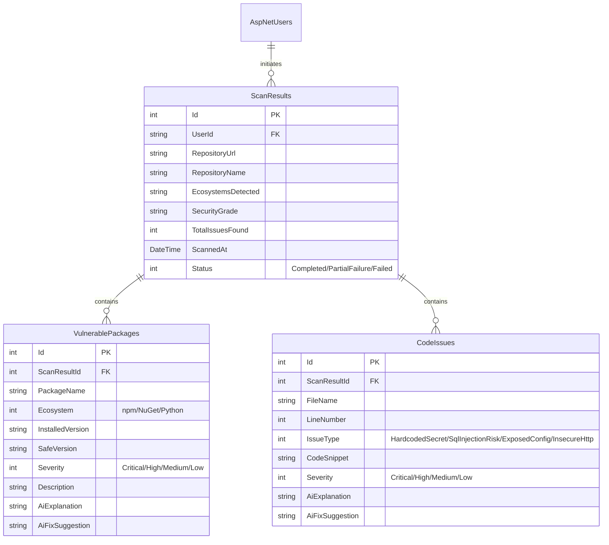

# 🛡️ CodeShield

A modular, web-based security scanner built with **ASP.NET Core (.NET 10)** that analyzes public GitHub repositories for package vulnerabilities and insecure code patterns. It retrieves dependency information, queries the **OSV.dev API** for known vulnerabilities, scans code for risks using safe, simple regular expression matches, and utilizes **AI-powered analysis** to explain risks and suggest remediation steps in plain English.

---

## 🚀 Key Features

*   **Repository Intake & Analysis**:
    *   Validates public GitHub repository URLs.
    *   Queries the GitHub REST API (mitigating rate-limiting with secure API tokens) to recursively retrieve repository file trees up to a **1000-file threshold**.
*   **Dependency Vulnerability Scanning**:
    *   Full support for **npm** (`package.json`) and **NuGet** (`.csproj`) dependency parsing.
    *   Queries the free, public **OSV.dev API** in batches to check package versions for known security vulnerabilities.
    *   Gracefully handles partial API failures, showing available results with helpful warnings.
*   **Code Pattern Security Scanning**:
    *   Scans code files (C#, JavaScript, Python) for insecure code patterns using safe, simplified regular expression matching (e.g., Raw SQL injection strings, exposed secrets, configurations, insecure HTTP).
    *   *Python Support*: Runs code pattern scanning when a `requirements.txt` is found. Prominently displays a warning banner stating package vulnerability lookup is not available for Python.
*   **AI-Generated Explanations & Fix Suggestions**:
    *   Uses AI endpoints via **AgentRouter** (Anthropic-compatible endpoint) to explain security issues in plain, accessible language and provide suggestions for fixes.
*   **User Accounts & Dashboard**:
    *   Secure user registration and authentication powered by **ASP.NET Core Identity**.
    *   Brute-force protection: Accounts are locked for 5 minutes after 5 failed login attempts.
    *   Provides a clean dashboard displaying scan histories, security grades, and detailed reports.

---

## 🛠️ Technology Stack

*   **Backend Framework**: ASP.NET Core (.NET 10)
*   **Frontend**: Razor Pages/Views + Bootstrap 5 (Responsive Layouts, Sleek UI Elements)
*   **Database & ORM**: MS SQL Server LocalDB (Development) / SQL Server (Production) via **Entity Framework Core (Code-First)**
*   **Authentication**: Cookie-based authentication using **ASP.NET Core Identity**
*   **External Integrations**:
    *   **GitHub REST API** (Repo structure and content retrieval)
    *   **OSV.dev API** (Public database vulnerability lookup)
    *   **AgentRouter API** (Anthropic-compatible AI endpoint for text remediation suggestions)

---

## 🔒 Scope Boundaries

To align with the project design guidelines, CodeShield strictly maintains the following scope:
1.  **Limited Ecosystems**: Supports `npm` and `NuGet` fully, and `Python` partially (code scanning only, no package vulnerability checks). Other packaging formats (Maven, PyPI API lookup, etc.) are out of scope.
2.  **No Automated Code Modifying**: AI suggestions are presented in the text/UI only. CodeShield will never commit changes or open Pull Requests on your scanned repository.
3.  **Public Repositories Only**: Accesses public repositories via basic file retrieval APIs. No OAuth flows or private repository credentials are required or supported.
4.  **On-Demand Scans Only**: Scans are initiated manually by users. No background workers, webhooks, or scheduled cron scanning tasks are supported.
5.  **Single User Role**: Accessible only to standard authenticated users (no administrative dashboards or multi-role permission hierarchies).

---

## 📂 Database Schema

CodeShield utilizes a lightweight relational database schema mapped with Entity Framework Core:



---

## ⚙️ Setup & Installation

### Prerequisites
*   [.NET 10 SDK](https://dotnet.microsoft.com/download/dotnet/10.0)
*   [MS SQL Server Express / LocalDB](https://learn.microsoft.com/en-us/sql/database-engine/configure-windows/sql-server-express-localdb)

### 1. Clone & Navigate to Project
```bash
git clone <repository-url>
cd CodeShield/CodeShield
```

### 2. Configure User Secrets
Do not commit sensitive API keys to the repository. Configure local credentials using the .NET Secret Manager:

```bash
# Initialize User Secrets
dotnet user-secrets init

# Add Connection String for LocalDB
dotnet user-secrets set "ConnectionStrings:DefaultConnection" "Server=(localdb)\mssqllocaldb;Database=CodeShieldDb;Trusted_Connection=True;MultipleActiveResultSets=true"

# Add GitHub Personal Access Token (to avoid rate limits on repo scan)
dotnet user-secrets set "GitHub:Token" "your_github_token"

# Add AgentRouter AI API Key
dotnet user-secrets set "AiService:ApiKey" "your_agent_router_api_key"
```

### 3. Database Migration & Initialization
Apply Entity Framework migrations to set up the SQL Server database:

```bash
dotnet ef database update
```

### 4. Run the Application
Start the development server:

```bash
dotnet run
```
The application will be accessible at: `https://localhost:7147` or `http://localhost:5213` (check terminal output for exact ports).

---

## 🧪 Running Tests

To run the unit/integration tests:

```bash
dotnet test
```
